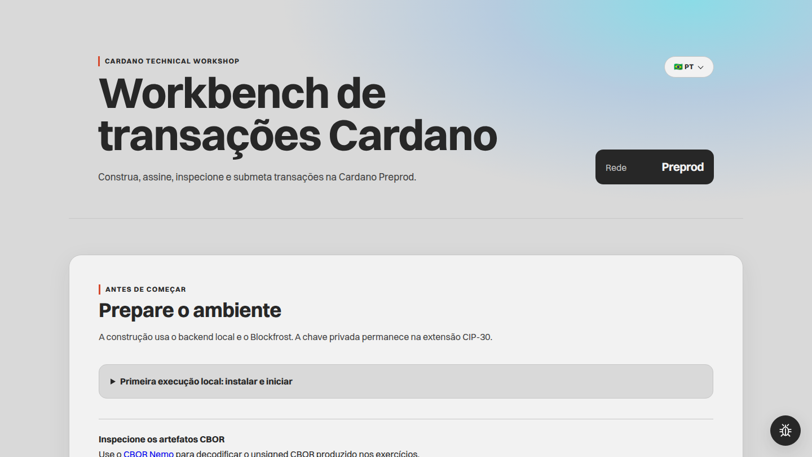

# cardano-technical-workshop

[English version](README.en.md)

Workshop técnico em TypeScript para construir transações Cardano com backend Node.js e assinatura por wallet CIP-30 no frontend.



A fronteira de custódia é explícita:

- o backend Node.js consulta a Cardano Preprod, constrói transações e submete via Blockfrost;
- a extensão CIP-30 assina no navegador sem expor a chave privada;
- a Workbench valida e exibe unsigned CBOR, witnesses, signed CBOR, transaction hash e inclusão em bloco.

## Requisitos

- Node.js 20.19.0 ou superior;
- Google Chrome ou Chromium disponível como `google-chrome` ou por `CHROME_BIN`, além de `gio` para descartar o perfil temporário do smoke test de navegador;
- projeto Blockfrost em Cardano Preprod;
- wallet CIP-30 configurada em Preprod;
- tADA em pelo menos um UTxO da wallet usada para construir transações;
- segunda wallet com outra chave de pagamento para o exercício multisig.

O identificador de rede CIP-30 diferencia mainnet de testnet, mas não diferencia Preprod de Preview. A seleção de Preprod precisa ser conferida na extensão.

## Setup

```bash
npm install
cp .env.example .env
# edite .env e carregue as variáveis no shell atual
set -a; source .env; set +a
npm run dev
```

Mantenha `CARDANO_NETWORK=preprod`. O backend rejeita Preview, mainnet e valores desconhecidos antes de iniciar.

Os serviços escutam apenas em `127.0.0.1` por padrão para não expor a credencial Blockfrost à rede local. Para outro bind, defina `HOST` no backend e passe um `--host` explícito ao Vite somente quando compreender o uso compartilhado da cota.

Acesse:

- Workbench: <http://127.0.0.1:5173>
- backend: <http://127.0.0.1:8787/api/health>
- prontidão: <http://127.0.0.1:8787/api/readiness>
- inspeção externa de CBOR: [CBOR Nemo](https://cbor.nemo157.com/)

O CBOR Nemo é uma ferramenta de terceiros. Não envie seed phrase, chave privada ou credencial Blockfrost. Prefira inspecionar o unsigned CBOR; quem obtiver um signed CBOR válido poderá submetê-lo à rede.

Para o fluxo CLI com chave no backend, crie `.seedphrase` localmente ou exporte `WALLET_MNEMONIC`. `.seedphrase`, `.env`, `dist/` e `node_modules/` são arquivos locais e não devem ser commitados.

## Dinâmica participante-led

A Workbench é o guia operacional autoritativo. Depois de uma introdução curta, o participante deve conseguir:

1. verificar backend, Blockfrost, wallet, rede e saldo;
2. entender objetivo, entradas, saída esperada e efeito de cada exercício;
3. seguir somente a próxima ação habilitada;
4. reconhecer build, assinatura, merge, submissão e inclusão;
5. corrigir um erro e tentar novamente sem perder o último checkpoint válido;
6. reiniciar apenas o exercício atual;
7. restaurar campos e artefatos preservados na mesma aba;
8. consultar o trecho de código real correspondente a cada etapa.

A sessão usa `sessionStorage`. Ela preserva endereços, CBOR e witnesses na aba atual, mas nunca armazena a chave privada ou o objeto CIP-30. Depois de recarregar a página, a wallet precisa ser conectada novamente. O script address e a lista de UTxOs do setup multisig não são persistidos; gere, confira e selecione esses dados novamente antes de um novo lock ou unlock.

## Idioma

O seletor `Idioma` da própria Workbench alterna entre português do Brasil e inglês sem recarregar a página. Português do Brasil (`pt-BR`) é o padrão, independentemente do idioma do navegador. A preferência explícita fica separada no `localStorage`, na chave `cardano-technical-workshop.locale.v1`, enquanto inputs, progresso e artefatos das transações permanecem no `sessionStorage`, na chave `cardano-technical-workshop.session.v1`.

A troca atualiza textos visíveis, nomes acessíveis, anúncios, formatação dependente de locale, `html.lang` e o header `Accept-Language` das requisições seguintes à API. A Workbench envia o locale selecionado, `pt-BR` ou `en`. O backend usa esse header para localizar a nota de prontidão e problemas estruturados, responde com `Content-Language` e inclui `Accept-Language` em `Vary`. Um header ausente ou sem locale compatível usa `pt-BR`.

A troca não reconstrói, assina, combina, submete, reinicia nem altera o estado das transações, o estado da sessão, os inputs, os artefatos ou a autorização da wallet. Um reload restaura separadamente a preferência de idioma e a sessão preservada, mas a wallet CIP-30 continua desconectada até uma nova autorização do participante.

## Exercícios

1. Pagamento simples.
2. Pagamento com metadata no label 674.
3. Multisig 2-de-2, com lock, seleção de UTxO, handoff de CBOR e unlock.
4. Native Asset em dois exemplos:
   - 4A: emissão didática de `EAC-WORKSHOP-001`, aposentadoria parcial por burn e metadata raw no label `65536` da faixa private use;
   - 4B: media token com metadata de apresentação CIP-25 no label `721`.

Cada pipeline mantém o mesmo contrato:

```text
backend constrói unsigned tx
wallet CIP-30 produz witness
browser valida e anexa witness
participante revisa o efeito
backend submete signed tx
Workbench verifica inclusão na Preprod
```

Cada cartão de etapa oferece `Ver código`. O modal identifica exercício, etapa, arquivo e intervalo de linhas e mostra um trecho extraído do código-fonte atual com realce sintático TypeScript. Builds limpos ligam o trecho ao commit Git exato. Com alterações locais sem commit, o caminho continua visível, mas não recebe um link remoto que representaria outro código. Abrir ou fechar o modal não altera inputs, progresso, artefatos nem sessão.

O hash é determinístico e pode ser calculado localmente antes da submissão. Uma resposta de sucesso do backend confirma que o Blockfrost aceitou a submissão. Se a resposta se perder, a Workbench preserva o hash como `resultado desconhecido`, permite consultar inclusão e só repete a submissão por ação explícita. Um `404` na consulta significa apenas que o Blockfrost ainda não indexa o hash; não confirma rejeição nem aceitação. O exercício só mostra conclusão quando o Blockfrost informa inclusão em um bloco. Essa inclusão não deve ser descrita como finalidade irreversível.

## Efeitos na Preprod

- Pagamento transfere tADA e paga taxa.
- Metadata transfere tADA e publica conteúdo visível na blockchain.
- Multisig lock move tADA para um script que exige duas chaves distintas. Uma configuração incorreta pode deixar o saldo inacessível.
- Multisig unlock consome o UTxO escolhido, envia o valor definido ao destino e devolve o troco ao script. A inclusão conclui uma rodada, não a recuperação total do saldo. Para mover o restante, reinicie o unlock, liste o novo UTxO e repita com as duas wallets.
- O exemplo EAC cria `1000000` unidades-base sintéticas de `EAC-WORKSHOP-001`. Com `decimals: 3`, a Workbench exibe `1.000,000 EAC`. Essa convenção de exibição não altera a quantidade inteira registrada no ledger. O saldo permanece na wallet conectada.
- A emissão anexa `methodology_hash`, `assurance_hash` e `evidence_root` no label `65536`. A aposentadoria queima `125000` unidades-base, mantém `875000` no output e anexa `declaration_hash` e `delivery_reference_hash` no mesmo label. Todos os hashes são sintéticos. O label private use não torna os dados confidenciais.
- A policy EAC é estável e exige a chave da wallet. Ela não valida metadata, não limita a oferta nem comprova alegações externas. A validade de aproximadamente três horas pertence a cada transação construída, não à policy.
- O exemplo CIP-25 cria unidades de um media token, usa ao menos 5 tADA no output e possui policy com validade de aproximadamente três horas.

Use wallets descartáveis e valores de testnet durante validação.

## Rotas principais

```text
GET  /api/health
GET  /api/readiness
GET  /api/readiness?address=addr_test...
GET  /api/transactions/:txHash/status
POST /api/workshop/01-payment
POST /api/workshop/02-metadata
POST /api/workshop/03-multisig/describe
POST /api/workshop/03-multisig/lock
POST /api/workshop/03-multisig/utxos
POST /api/workshop/03-multisig/verify-input
POST /api/workshop/03-multisig/unlock
POST /api/workshop/04a-mint-eac
POST /api/workshop/04a-retire-eac
POST /api/workshop/04b-mint-cip25
POST /api/submit-tx
```

As rotas anteriores `/api/workshop/03-mint-cip25`, `/api/workshop/04-mint-cip25` e `/api/workshop/04-multisig/*` permanecem como aliases de compatibilidade.

## CLI de apoio

```bash
npm run start -- address
npm run start -- send-ada addr_test... 100000000
npm run start -- build-cbor addr_test... 100000000
npm run start -- build-cbor-metadata addr_test... 100000000 "Hello, Cardano!"
npm run start -- multisig-info second_signer_addr_test...
npm run start -- lock-multisig second_signer_addr_test... 10000000
npm run start -- build-multisig-partial second_signer_addr_test... destination_addr_test... 2000000 txhash#index
npm run start -- mint-cip25 recipient_addr_test... MyLittleToken 10 "My Little Token" ipfs://... "Description"
npm run start -- sign-cbor <unsigned_tx_cbor>
```

O CLI `sign-cbor` pode produzir o segundo witness do unlock. O unsigned CBOR é o objeto compartilhado; cada signer devolve somente seu witness.

## Validação

```bash
# descobre recursivamente todos os arquivos *.test.ts
npm test
npm run build
# com npm run dev ativo em outro terminal
npm run test:browser
# ou com build novo, backend isolado e Blockfrost propositalmente desconfigurado
npm run test:browser:isolated
```

Os testes de Node cobrem validação de requests, dispatch básico da CLI, construção local das transações com respostas Blockfrost controladas, schema raw da emissão EAC, policy EAC estável, rede e valores, signers multisig distintos, inspeção de CBOR importado, prontidão Blockfrost, consulta de inclusão, submissão ambígua, hash divergente, resumos derivados da transação, validade dos mints, erros HTTP, progressão do pipeline, invalidação de artefatos, retry, restauração de sessão e localização.

O smoke test de navegador aceita tanto um backend Blockfrost pronto quanto um backend desconfigurado ou temporariamente indisponível. Ele verifica a coerência da prontidão renderizada, localização, acessibilidade, layout, restauração e utilitários da interface. Ele não constrói, assina, submete nem confirma uma transação real. Essa última validação exige uma wallet CIP-30 financiada em Preprod e autorização explícita do participante.

## Roteiro de facilitação

[`passoapasso.md`](passoapasso.md) contém o modelo mental, perguntas de discussão e notas para o facilitador. Ele não duplica a sequência de botões da interface. A [versão em inglês](passoapasso.en.md) também está disponível.

## Licença

MIT.
